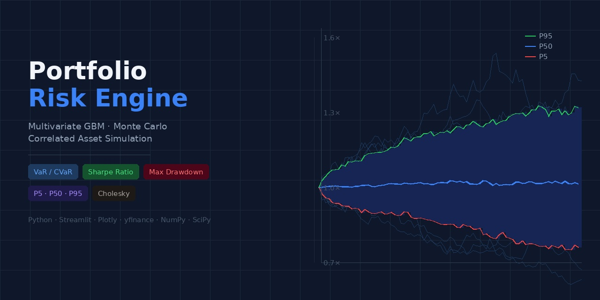

# Portfolio Risk Engine
A multivariate Monte Carlo simulation dashboard for portfolio risk analysis, built with Streamlit. Models correlated asset price evolution using Geometric Brownian Motion (GBM) with Cholesky decomposition, and computes key risk metrics across configurable forecast horizons.


## Features

* __Portfolio builder__: select up to 10 assets from a curated list of US stocks and ETFs, specify share counts, and manage your portfolio from the sidebar
* __Live market data__: pulls historical adjusted closing prices via yfinance with 5-minute caching
* __Historical analytics__: portfolio value chart with per-asset contribution breakdown, plus annualised return, volatility, Sharpe ratio, and max drawdown
* __Multivariate GBM simulation__: estimates per-asset drift and a full covariance matrix from historical returns; uses Cholesky decomposition to generate correlated Brownian motion paths
* __Risk metrics__: Value at Risk (VaR), Conditional VaR (CVaR), probability of loss, probability of doubling, CAGR at median, and Sharpe ratio
* __Visualisations__: fan chart with percentile bands (P5/P25/P50/P75/P95), final value histogram, max drawdown distribution, and asset correlation heatmap
* __Multi-horizon comparison__: automatically runs lightweight simulations across 1 month to 2 years and presents a summary table
* __Scenario decision guide__: maps each percentile to a plain-English planning use case


## Getting Started
__Prerequisites__
* Python 3.10 or higher


__Installation__
```
git clone https://github.com/Sahar-Salmanz/portfolio_gbm_dashboard.git
cd portfolio_gbm_dashboard
pip install -r requirements.txt
```


__Run__
```
streamlit run src/app.py
```


__Requirements__
```
streamlit=1.54.0
yfinance=1.2.0
plotly=6.6.0
numpy=2.2.5
pandas=2.3.3
scipy=1.15.3
```

Or install directly:
```
pip install streamlit yfinance plotly numpy pandas scipy
```


## Project Structure
```
portfolio_gbm_dashboard/
├── app.py                   # Entry point — page config, session state, orchestration
├── src/
│   ├── data/
│   │   ├── fetcher.py       # yfinance data fetching with Streamlit caching
│   │   ├── formatting.py    # Dollar, percentage, and delta formatting helpers
│   │   └── validator.py     # Portfolio input validation logic
│   ├── models/
│   │   ├── simulation.py    # MC results: fan chart, distributions, correlation heatmap
│   │   ├── gbm.py           # Multivariate GBM engine + SimulationResult dataclass
│   │   └── metrics.py       # Historical metrics, multi-horizon summary, decision table
│   ├── ui/
│   │   ├── sidebar.py       # Sidebar rendering + SidebarState dataclass
│   │   ├── portfolio.py     # Portfolio table, historical chart, hist. metrics
│   │   └── styles.py        # Minimal CSS injection (risk badge colours only)
│   └── utils/
│       └── config.py            # All constants: asset universe, palette, simulation defaults
└── README.md
```


## How It Works
__Geometric Brownian Motion__

Each asset price follows:
$$S_i(t + \Delta t) = S_i(t) \exp \big[\big(\mu_i - \frac{\sigma_i^2}{2} \big) \Delta t + \sigma_i \sqrt{\Delta t} Z_i \big]$$

where $\mu_i$ and $\sigma_i^2$ are estimated from historical log-returns.


__Cholesky Decomposition for Correlated Paths__

To preserve the empirical pairwise correlations between assets, the covariance matrix $\Sigma$ is decomposed as $\Sigma = LL^\top$. Correlated noise is then generated as:

$$Z_{corr} ​= Z_{iid} ​⋅ L^\top$$

This ensures that if AAPL and MSFT historically move together, the simulated paths reflect that dependency.


## Risk Metrics
|Metric|Description|
|------|-----------|
|VaR (95%)|The loss exceeded in only 5% of simulations|
|CVaR (95%)|Average loss in the worst 5% of simulations|
|Sharpe ratio|Annualised excess return per unit of volatility|
|Max drawdown|Largest peak-to-trough decline across simulated paths|
|CAGR @ P50|Compound annual growth rate implied by the median outcome|


## Usage
1. Use the sidebar to add assets and share counts to your portfolio
2. Set the years of historical data to use for parameter estimation
3. Choose a forecast horizon and number of simulations
4. Click __Run simulation__
5. Review the fan chart, risk metrics, and scenario decision guide